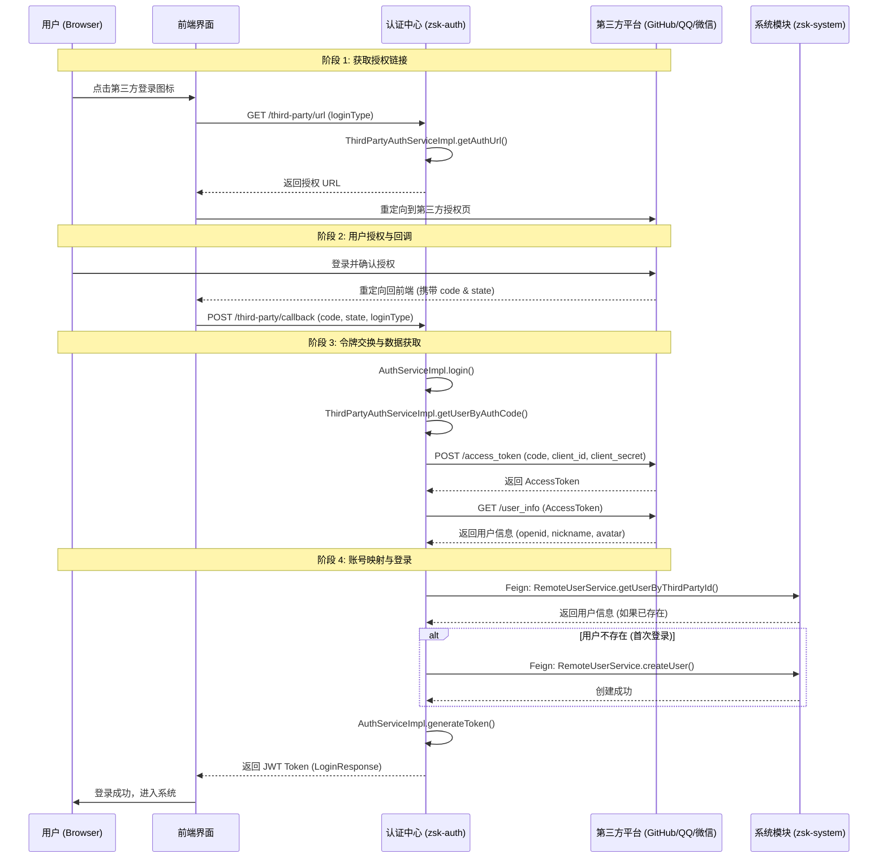

# ZSK-Cloud 企业级微服务脚手架

## 🚀 项目概述
ZSK-Cloud 是一款基于最新技术栈构建的企业级微服务开发脚手架，旨在为开发者提供高性能、高可用、可快速扩展的底座。

- **核心架构**: 基于 Java 21、Spring Boot 3.5.0 及 Spring Cloud 2025.0.0。
- **治理中心**: 集成 Nacos 3.1.1、Sentinel 流量控制、Spring Cloud Gateway。
- **核心功能**: 包含认证授权、分布式事务、动态数据源、多租户支持及统一对象存储（Minio/OSS）。

---

## 🛠️ 技术栈
| 类别 | 关键技术 | 说明 |
| :--- | :--- | :--- |
| **开发环境** | JDK 21 / Maven 3.9+ | 享受最新 Java 特性 |
| **核心框架** | Spring Boot 3.5 / Spring Cloud 2025 | 官方推荐稳定版本 |
| **服务治理** | Nacos / Sentinel / Gateway | 全套微服务治理方案 |
| **持久层** | MyBatis-Plus / mongdb / MySQL 8 | 灵活高效的 ORM 框架 |
| **缓存/队列** | Redis (Redisson) / RocketMQ | 高性能数据处理 |
| **安全认证** | Spring Security / JWT / BCrypt | 严密的权限控制体系 |
| **文档/监控** | Knife4j / SpringDoc / Prometheus | 完善的 API 与运维监控 |

---

## 📂 项目结构
```text
zsk-cloud
├── zsk-api               // 接口模块 (Feign 客户端)
├── zsk-auth              // 认证中心 (登录、鉴权、第三方登录)
├── zsk-common            // 通用组件 (Core, Security, Redis, OSS, Log等)
├── zsk-gateway           // 网关中心 (动态路由、限流、黑名单)
├── zsk-module            // 业务模块
│   ├── zsk-module-system   // 系统管理 (用户、角色、权限、字典)
│   └── zsk-module-document // 文档管理 (笔记、文件、视频评论、流程)
├── zsk-visual            // 图形化监控 (Monitor, Sentinel DashBoard等)
├── sql                   // 数据库脚本
└── init                  // 环境初始化配置 (Nacos 配置文件等)
```

---

## ✨ 已实现功能
- **统一鉴权**: 基于 JWT 的令牌机制，支持单点登录、图形验证码及邮箱验证。采用“私钥签名、公钥验证”模式，并支持 `keyLocator` 自动兼容对称与非对称算法。
- **权限管理**: 完善的 RBAC 模型，细粒度的权限注解控制。
- **第三方登录**: 集成 QQ、微信、GitHub 授权登录，支持 OAuth2 流程及账号自动映射。
- **系统工具**: 动态数据源切换、全局异常拦截、统一响应格式、操作日志采集。
- **业务场景**: 实现了完整的文档笔记管理流程、文件上传预览、视频互动评论等。

---

## 🔐 第三方登录流程
项目遵循标准的 OAuth2 授权码模式，实现“即登即用”：

---

## 🛡️ 安全机制说明
### **JWT 密钥管理**
项目支持 **对称加密 (HS256)** 与 **非对称加密 (RS256)** 的动态兼容：
- **签名原则**：遵循“私钥签名、公钥验证”。私钥仅保存在认证中心（zsk-auth），用于签发令牌；公钥分发给各微服务，用于校验令牌合法性。
- **智能解析**：通过 `keyLocator` 机制，系统能根据令牌头部的算法 (`alg`) 自动匹配密钥。若 `alg` 为 `RS256` 则使用公钥验证，若为 `HS256` 则回退至 `secret` 验证，确保了配置迁移过程中的平滑过渡。

---

### **详细调用链路**


### **核心逻辑步骤**
1. **获取授权**: 前端请求后端接口获取第三方授权 URL，用户跳转至第三方平台登录。
2. **回调校验**: 授权后携带 `code` 返回前端，前端调用后端回调接口进行 `state` 校验。
3. **令牌交换**: 后端使用 `code`换取第三方 `access_token`，并拉取用户信息（OpenID、昵称、头像）。
4. **自动注册与映射**: 
   - 系统根据 `loginType` + `thirdPartyId` 匹配用户。
   - **首次登录**：系统自动根据第三方信息创建新账号，完成账号绑定。
5. **颁发令牌**: 验证通过后，后端颁发 JWT 令牌，完成登录流程。

---

## 🚧 待开发与规划
- **分布式调度**: 深度集成 XXL-JOB 任务调度。
- **监控大屏**: 完善可视化监控面板与链路追踪（SkyWalking）。
- **工作流引擎**: 集成 Flowable 实现更复杂的 BPMN 2.0 业务流。
- **容器化部署**: 提供 Docker-compose 与 K8s 部署脚本。

---

## 📖 快速上手
1. **克隆项目**: `git clone https://github.com/zsk-cloud/zsk-cloud.git`
2. **初始化环境**: 执行 `sql/` 下的脚本，并在 Nacos 中导入 `init/nacos/` 下的配置文件。
3. **本地启动**:
    - 启动 `ZskGatewayApplication` (网关)
    - 启动 `ZskAuthApplication` (认证)
    - 启动各业务模块应用
4. **访问文档**: `http://localhost:8080/doc.html` (通过网关访问聚合文档)

---

## 📄 相关文档
- [详细项目总结](./PROJECT_SUMMARY.md)
- [开发规范指南](./docs/开发文档.md)
- [数据库规范](.trae/rules/prorules.md)
