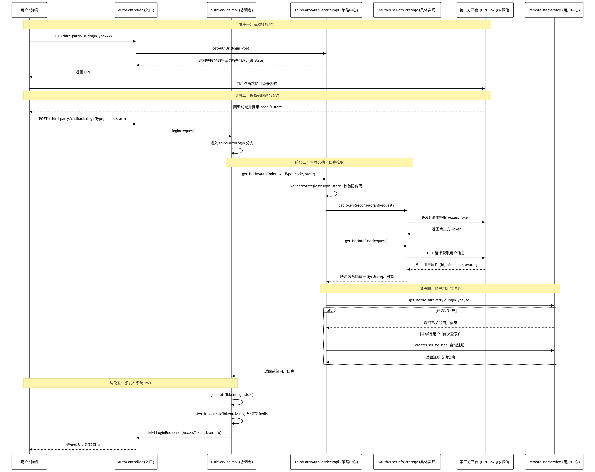

# ZSK-Cloud

基于 Java 21 / Spring Boot 3.5.0 / Spring Cloud 2025.0.0 构建的企业级微服务脚手架，集成 Nacos 注册配置、Sentinel 流控、Spring Cloud Gateway 网关、MyBatis-Plus 持久层、Redis/Redisson 缓存与分布式锁、统一对象存储、RBAC 权限、多模式登录、Redis Bitmap 交互系统、统一审核中心，提供 Docker 容器化部署方案。

前端项目：[zsk-ui-v2](https://github.com/MmzMing/zsk-ui-v2)

---

## 技术栈

| 类别 | 技术 | 版本 | 用途 |
| :--- | :--- | :--- | :--- |
| 运行环境 | JDK | 21 | 虚拟线程、Record、密封类 |
| | Maven | 3.9+ | 构建工具 |
| 核心框架 | Spring Boot | 3.5.0 | 基础框架 |
| | Spring Cloud | 2025.0.0 | 微服务治理 |
| | Spring Cloud Alibaba | 2025.0.0.0 | 阿里微服务生态 |
| 服务治理 | Nacos | 3.1.1 | 注册中心 + 配置中心 |
| | Sentinel | 3.1.1 | 限流 / 熔断 / 降级 |
| | Spring Cloud Gateway | 4.x | API 网关 |
| 持久层 | MyBatis-Plus | 3.5.7 | ORM |
| | MySQL | 8.3.0 | 关系型数据库 |
| | MongoDB | 6.x | 行为审计 / 操作日志 |
| | Druid | 1.2.23 | 连接池 |
| | Dynamic Datasource | 4.3.1 | 主从数据源切换 |
| 缓存 | Redis / Lettuce | 3.4.1 / 6.3.2 | 缓存 |
| | Redisson | 3.27.0 | 分布式锁 / Bitmap |
| | Caffeine | 3.1.8 | 本地缓存 |
| 安全 | Spring Security | 6.x | 权限控制 |
| | JJWT | 0.12.5 | JWT（HS256 / RS256） |
| | Bouncy Castle | 1.78 | RSA 加密 |
| | OAuth2 | - | QQ / 微信 / GitHub 登录 |
| 存储 | MinIO | 8.5.8 | 对象存储（含分片上传） |
| | 阿里云 OSS | 3.18.1 | 云存储 |
| 工具 | Hutool | 5.8.40 | 工具集 |
| | Guava | 33.0.0-jre | Google 工具库 |
| | MapStruct | 1.5.5.Final | 对象映射 |
| | Lombok | 1.18.36 | 代码简化 |
| | EasyExcel | 4.0.3 | Excel 导入导出 |
| | Kryo | 5.6.0 | 序列化 |
| | TTL | 2.14.5 | 跨线程上下文传递 |
| 文档 | Knife4j | 4.5.0 | OpenAPI 3 增强 UI |
| | SpringDoc | 2.8.4 | API 文档生成 |
| 调度 | XXL-JOB | 2.4.1 | 分布式调度（预留） |

---

## 项目结构

```
zsk-cloud
├── zsk-api                          # Feign 远程调用接口
│   ├── zsk-api-system               #   系统 Feign（用户 / 字典）
│   └── zsk-api-document             #   文档 Feign（内容 / 文件 / 统计）
├── zsk-auth                         # 认证中心
├── zsk-common                       # 通用 Starter（9 个）
│   ├── zsk-common-core              #   R<T> / 异常 / SecurityContext / JwtUtils
│   ├── zsk-common-security          #   权限注解 / HeaderContextFilter / 防重提交
│   ├── zsk-common-redis             #   Redis / Redisson / @RedisLock / Bitmap
│   ├── zsk-common-oss               #   MinIO / Aliyun OSS / 分片上传
│   ├── zsk-common-datasource        #   @Master / @Slave / MyBatis-Plus 自动填充
│   ├── zsk-common-log               #   @Log 操作日志 AOP
│   ├── zsk-common-swagger           #   Knife4j / SpringDoc 自动配置
│   ├── zsk-common-sentinel          #   @RateLimit / @CircuitBreaker
│   └── zsk-common-xxljob            #   XXL-JOB（预留）
├── zsk-gateway                      # API 网关
├── zsk-module                       # 业务模块
│   ├── zsk-module-system            #   系统管理（16 Controller / 110 API）
│   └── zsk-module-document          #   文档管理（19 Controller / 100 API）
├── zsk-visual                       # 监控
│   └── zsk-visual-monitor           #   监控中心（占位）
├── init                             # 初始化
│   ├── nacos/dev                    #   开发环境 Nacos 配置
│   ├── nacos/prod                   #   生产环境 Nacos 配置
│   └── sql                          #   数据库脚本
├── docs                             # 文档
│   ├── api                          #   API 接口文档（按模块分类）
│   └── 相关设计                      #   设计文档
└── docker-compose.yml               # 容器编排
```

---

## 微服务详情

### zsk-gateway — API 网关

| 项目 | 说明 |
| :--- | :--- |
| 端口 | 8080 |
| 入口类 | `ZskGatewayApplication` |
| 技术栈 | Spring Cloud Gateway（响应式）、Nacos Discovery、Sentinel |
| Controller | 0（纯 Filter 链处理） |

**目录结构**

```
com.zsk.gateway
├── config/
│   ├── WebConfig.java
│   └── properties/
│       ├── IgnoreWhiteProperties.java      # 白名单配置
│       └── XssProperties.java             # XSS 排除路径配置
├── filter/
│   ├── AuthFilter.java                    # JWT 验证 + 用户信息注入 Header
│   ├── BlackListFilter.java              # IP 黑名单拦截
│   ├── LogFilter.java                     # 请求日志
│   └── XssFilter.java                    # XSS 过滤
└── handler/
    └── GatewayExceptionHandler.java       # 全局异常
```

**Filter 链**

| Filter | 功能 |
| :--- | :--- |
| AuthFilter | JWT 校验 → 白名单放行 → Redis Token 状态验证 → Header 注入（userId / username / nickname / roles / permissions）→ 滑动过期 |
| BlackListFilter | Redis Set 存储 IP 黑名单，请求匹配即拦截 |
| XssFilter | URL 查询参数 XSS 清洗，支持排除路径 |
| LogFilter | 记录 RequestId / Method / Path / RemoteAddr / StatusCode / Duration |

**动态路由**

| 路径模式 | 目标服务 |
| :--- | :--- |
| `/api/auth/**` | zsk-auth |
| `/api/system/**` | zsk-module-system |
| `/api/document/**` | zsk-module-document |

---

### zsk-auth — 认证中心

| 项目 | 说明 |
| :--- | :--- |
| 端口 | 10010 |
| 入口类 | `ZskAuthApplication` |
| 技术栈 | Spring Security、JJWT（HS256 / RS256）、Bouncy Castle（RSA）、Spring Boot Mail |
| Controller | 2 |
| API 总数 | 21（GET 9 / POST 12） |

**目录结构**

```
com.zsk.auth
├── config/
│   ├── EncryptProperties.java             # RSA 密钥配置
│   ├── OAuth2ClientConfig.java            # OAuth2 客户端配置
│   └── TurnstileProperties.java          # Turnstile 配置（预留）
├── controller/
│   ├── AuthController.java               # 19 个端点
│   └── AuthHelloController.java          # 2 个测试端点
├── domain/
│   ├── CaptchaCheckRequest.java
│   ├── CaptchaResponse.java
│   ├── LoginRequest.java
│   ├── LoginResponse.java
│   ├── MagicLinkRequest.java
│   ├── PublicKeyResponse.java
│   └── RegisterBody.java
├── service/
│   ├── IAuthService.java
│   ├── ICaptchaService.java
│   ├── IEmailService.java
│   ├── IEncryptService.java
│   ├── IThirdPartyAuthService.java
│   └── impl/
│       ├── AuthServiceImpl.java
│       ├── CaptchaServiceImpl.java
│       ├── EmailServiceImpl.java
│       ├── EncryptServiceImpl.java
│       └── ThirdPartyAuthServiceImpl.java
└── strategy/
    ├── OAuth2UserInfoStrategy.java        # 策略接口
    └── impl/
        ├── GithubUserInfoStrategy.java
        ├── QQUserInfoStrategy.java
        └── WeChatUserInfoStrategy.java
```

**API 清单**

| 方法 | 路径 | 说明 |
| :--- | :--- | :--- |
| POST | `/login` | 密码登录 |
| POST | `/register` | 用户注册 |
| POST | `/logout` | 退出登录 |
| POST | `/refresh` | 令牌刷新 |
| GET | `/captcha` | 获取滑块验证码 |
| POST | `/captcha/check` | 校验验证码 |
| GET | `/public-key` | 获取 RSA 公钥 |
| POST | `/email/code` | 发送邮箱验证码 |
| POST | `/email/code/username` | 根据用户名发送邮箱验证码 |
| POST | `/password/reset/code` | 发送密码重置验证码 |
| POST | `/password/reset/verify` | 验证重置验证码 |
| POST | `/password/reset` | 重置密码 |
| POST | `/magic-link/send` | 发送魔法链接 |
| GET | `/magic-link/callback` | 魔法链接回调 |
| GET | `/third-party/url` | 获取第三方授权地址 |
| POST | `/third-party/callback` | 第三方登录回调 |
| GET | `/github/callback` | GitHub 回调 |
| GET | `/wechat/callback` | 微信回调 |
| GET | `/qq/callback` | QQ 回调 |

**核心机制**

| 机制 | 说明 |
| :--- | :--- |
| JWT 双模 | keyLocator 根据 alg 头自动匹配：RS256 → 公钥验证，HS256 → secret 验证 |
| RSA 密码加密 | 前端 RSA 公钥加密，后端私钥解密，防明文传输 |
| 多设备登录 | 单用户最多 5 个有效 Token，Redis Set 存储 |
| 接口限流 | 注册 10次/分、登录 10次/分、邮箱验证码 5次/分、魔法链接 3次/分、密码重置 3次/分 |
| OAuth2 策略 | Strategy 模式，QQ / 微信 / GitHub 各实现 `OAuth2UserInfoStrategy` |

---

### zsk-module-system — 系统管理

| 项目 | 说明 |
| :--- | :--- |
| 端口 | 20010 |
| 入口类 | `ZskSystemApplication` |
| 技术栈 | MyBatis-Plus、Druid、Dynamic-Datasource、Spring Security、MongoDB |
| Controller | 16 |
| API 总数 | 110（GET 56 / POST 18 / PUT 19 / DELETE 17） |

**目录结构**

```
com.zsk.system
├── config/
│   └── ToolboxProperties.java            # 工具箱配置驱动
├── controller/                           # 16 个 Controller
│   ├── CacheSysController.java          # 22 API — Redis 缓存管理
│   ├── SysUserController.java           # 18 API — 用户管理
│   ├── SysRoleController.java           # 13 API — 角色管理
│   ├── SysDictTypeController.java       # 14 API — 字典类型
│   ├── SysDictDataController.java       #  9 API — 字典数据
│   ├── SysMenuController.java           #  8 API — 菜单管理
│   ├── SysNoticeController.java         #  7 API — 通知公告
│   ├── SysConfigController.java         #  6 API — 参数配置
│   ├── SysMonitorController.java        #  5 API — 系统监控
│   ├── SysTaskController.java           #  5 API — 任务管理
│   ├── SysBehaviorController.java       #  3 API — 行为审计
│   ├── SysTaskLinkController.java       #  3 API — 任务依赖
│   ├── SysLogController.java            #  2 API — 操作日志
│   ├── SysLoginManageController.java    #  2 API — 登录管理
│   ├── ToolboxController.java           #  2 API — 工具箱
│   └── SysDashboardController.java      #  1 API — 仪表盘
├── domain/                               # 15 DO + 14 DTO + 24 VO
├── mapper/                               # 11 Mapper
└── service/                              # 16 Service 接口 + 16 Impl
```

**功能模块**

| 模块 | Controller | API 数 | 说明 |
| :--- | :--- | :---: | :--- |
| 缓存管理 | CacheSysController | 22 | Redis 实例管理、键查询/刷新/删除/批量操作、统计信息、内存使用、TTL 刷新、缓存预热 |
| 用户管理 | SysUserController | 18 | CRUD、状态切换、密码重置、头像上传 |
| 角色管理 | SysRoleController | 13 | CRUD、复制角色、菜单分配、用户分配 |
| 字典类型 | SysDictTypeController | 14 | CRUD、状态切换、批量状态切换 |
| 字典数据 | SysDictDataController | 9 | CRUD、状态切换 |
| 菜单管理 | SysMenuController | 8 | 树形结构 CRUD、批量更新 |
| 通知公告 | SysNoticeController | 7 | CRUD、控制台公告查询 |
| 参数配置 | SysConfigController | 6 | 系统参数 CRUD |
| 系统监控 | SysMonitorController | 5 | 服务器数据采集、概览、趋势、手动采集、数据清理 |
| 任务管理 | SysTaskController | 5 | 甘特图任务 CRUD（task / project / milestone） |
| 行为审计 | SysBehaviorController | 3 | 用户行为查询、事件查询（MongoDB） |
| 任务依赖 | SysTaskLinkController | 3 | 4 种依赖类型、循环依赖检测 |
| 操作日志 | SysLogController | 2 | 分页查询、批量删除 |
| 登录管理 | SysLoginManageController | 2 | 在线用户分页、强制下线 |
| 工具箱 | ToolboxController | 2 | JSON 格式化、Base64 编解码、时间戳转换（配置驱动） |
| 仪表盘 | SysDashboardController | 1 | 系统概览数据 |

---

### zsk-module-document — 文档管理

| 项目 | 说明 |
| :--- | :--- |
| 端口 | 20020 |
| 入口类 | `ZskDocumentApplication` |
| 技术栈 | MyBatis-Plus、Redis Bitmap、MinIO / Aliyun OSS、Spring Data MongoDB |
| Controller | 19 |
| API 总数 | 100（GET 49 / POST 27 / PUT 15 / DELETE 9） |

**目录结构**

```
com.zsk.document
├── controller/                           # 19 个 Controller
│   ├── DocNoteController.java           # 15 API — 笔记管理
│   ├── DocVideoController.java          # 14 API — 视频管理
│   ├── DocHomeVideoController.java      #  8 API — 前台视频详情
│   ├── DocHomeNoteController.java       #  7 API — 前台笔记详情
│   ├── DocNoteCommentController.java    #  9 API — 笔记评论
│   ├── DocVideoCommentController.java   #  9 API — 视频评论
│   ├── DocVideoCollectionController.java#  9 API — 视频合集
│   ├── DocAuditController.java          #  6 API — 统一审核
│   ├── DocProcessController.java        #  6 API — 文件处理任务
│   ├── DocProcessHistoryController.java #  6 API — 处理历史
│   ├── DocFilesController.java          #  6 API — 文件管理
│   ├── DocNoteDtlAggregateController.java# 4 API — 笔记聚合
│   ├── DocNoteDtlController.java        #  4 API — 笔记详情
│   ├── DocHomeUserController.java       #  2 API — 前台用户主页
│   ├── DocOssConfigController.java      #  2 API — OSS 配置
│   ├── DocNoteCategoryController.java   #  2 API — 分类标签
│   ├── DocAllContentController.java     #  2 API — 全部内容
│   ├── DocOssTestController.java        #  1 API — OSS 测试
│   └── SearchController.java            #  1 API — 全局搜索
├── domain/                               # 12 DO + 9 DTO + 40+ VO
├── enums/                                # 交互缓存枚举 / 搜索枚举
├── job/
│   └── CacheDocSocialSyncJob.java       # Bitmap → DB 定时同步
├── mapper/                               # 12 Mapper
└── service/                              # 23 Service 接口 + 23 Impl + 4 审核策略
    └── audit/
        ├── AuditTargetStrategy.java      # 审核策略接口
        ├── DocNoteAuditStrategy.java
        ├── DocNoteCommentAuditStrategy.java
        ├── DocVideoAuditStrategy.java
        └── DocVideoCommentAuditStrategy.java
```

**功能模块**

| 模块 | Controller | API 数 | 说明 |
| :--- | :--- | :---: | :--- |
| 笔记管理 | DocNoteController | 15 | CRUD、草稿管理、状态批量更新、分类批量迁移、置顶/推荐、统计信息 |
| 视频管理 | DocVideoController | 14 | CRUD、草稿管理、视频上传、状态批量更新、置顶/推荐 |
| 前台视频 | DocHomeVideoController | 8 | 元信息+详情、交互、评论、合集（区域化接口） |
| 前台笔记 | DocHomeNoteController | 7 | 元信息+详情、交互、评论（区域化接口） |
| 笔记评论 | DocNoteCommentController | 9 | B站式二级评论、评论点赞（Redis 缓存）、热门/最新排序 |
| 视频评论 | DocVideoCommentController | 9 | 同上 |
| 视频合集 | DocVideoCollectionController | 9 | 合集 CRUD、添加/移除视频、排序管理 |
| 统一审核 | DocAuditController | 6 | 审核队列、审核详情、提交/批量提交、审核日志、违规原因 |
| 文件处理 | DocProcessController | 6 | 转码任务管理 |
| 处理历史 | DocProcessHistoryController | 6 | 处理历史记录 |
| 文件管理 | DocFilesController | 6 | 上传、删除、分片上传（init / upload / complete） |
| 笔记聚合 | DocNoteDtlAggregateController | 4 | 全量创建/查询/更新/删除 |
| 笔记详情 | DocNoteDtlController | 4 | Markdown 内容管理、MD 文件上传 |
| 前台用户 | DocHomeUserController | 2 | 用户统计（点赞/关注/收藏数） |
| OSS 配置 | DocOssConfigController | 2 | MinIO / Aliyun OSS 动态配置刷新 |
| 分类标签 | DocNoteCategoryController | 2 | 文档分类标签查询 |
| 全部内容 | DocAllContentController | 2 | 用户统计 + 内容统计 |
| OSS 测试 | DocOssTestController | 1 | 分片上传测试 |
| 全局搜索 | SearchController | 1 | 关键字搜索、类型/分类筛选、热门/点赞排序 |

**交互系统（Redis Bitmap）**

| 交互类型 | Bitmap Key 格式 | 说明 |
| :--- | :--- | :--- |
| 点赞 | `like:{targetType}:{targetId}` | 4 种目标类型（笔记/视频/笔记评论/视频评论） |
| 收藏 | `collect:{targetType}:{targetId}` | 同上 |
| 关注 | `follow:{userId}` | 用户关注关系 |
| 浏览 | `view:{targetType}:{targetId}` | 浏览量计数 |

`CacheDocSocialSyncJob` 定时将 Bitmap 数据同步到 `document_user_interaction` 表。

---

### zsk-common — 通用 Starter

9 个 Starter，均通过 `META-INF/spring/org.springframework.boot.autoconfigure.AutoConfiguration.imports` 自动注册，业务模块引入 Maven 依赖即可生效。

**依赖关系**

```
zsk-common-core（基础层，无内部依赖）
├── zsk-common-datasource
├── zsk-common-redis
├── zsk-common-xxljob
├── zsk-common-oss
├── zsk-common-swagger（独立，不依赖 core）
├── zsk-common-security → zsk-common-redis
│   └── zsk-common-log → zsk-common-security
└── zsk-common-sentinel → zsk-common-redis
```

| Starter | 核心类 | 说明 |
| :--- | :--- | :--- |
| zsk-common-core | `R<T>` / `BusinessException` / `GlobalExceptionHandler` / `SecurityContext` / `JwtUtils` / `@Sensitive` | 统一响应、40+ ResultCode、10+ 异常类、TTL 线程上下文、敏感数据序列化 |
| zsk-common-security | `HeaderContextFilter` / `@RepeatSubmit` / `@InnerAuth` / `@RequiresPermissions` / `SecurityUtils` | 网关头解析、防重提交、内部接口保护、权限注解 |
| zsk-common-redis | `RedisService` / `LockService` / `@RedisLock` / `BitmapOffsetUtil` | 通用缓存操作、分布式锁、Bitmap 工具 |
| zsk-common-oss | `MinioTemplate` / `AliyunTemplate` / `DynamicOssTemplate` / `OssPart` | 统一对象存储、动态切换、分片上传 |
| zsk-common-datasource | `MybatisPlusConfig` / `PageQuery` / `@Master` / `@Slave` / `MybatisPlusMetaObjectHandler` | 动态数据源、分页组件、自动填充 |
| zsk-common-log | `@Log` / `LogAspect` / `OperLog` | 操作日志 AOP 采集，存储到 MongoDB |
| zsk-common-swagger | `SwaggerConfig` / `SwaggerProperties` | Knife4j + SpringDoc 自动配置 |
| zsk-common-sentinel | `@RateLimit` / `@CircuitBreaker` / `SentinelBlockHandler` | 限流（SpEL）、熔断、统一异常处理 |
| zsk-common-xxljob | `XxlJobAutoConfiguration` / `XxlJobRegister` / `@XxlJobAutoRegister` | XXL-JOB 自动注册（预留） |

---

### zsk-api — Feign 远程调用

| 子模块 | Feign 接口 | 方法数 | 降级工厂 | DTO |
| :--- | :--- | :---: | :--- | :--- |
| zsk-api-system | `RemoteUserService` | 7 | `RemoteUserFallbackFactory` | `SysUserApi` / `LoginUser` |
| | `RemoteDictService` | 2 | `RemoteDictFallbackFactory` | `SysDictDataApi` |
| zsk-api-document | `RemoteDocumentContentService` | 5 | `RemoteDocumentContentFallbackFactory` | `DocNoteDetailApi` / `DocCommentApi` |
| | `RemoteDocFilesService` | 2 | `RemoteDocFilesFallbackFactory` | `DocFilesApi` |
| | `RemoteDocAllContentService` | 2 | `RemoteDocAllContentFallbackFactory` | `DocStatisticsApi` / `DocUserStatsApi` 等 |

所有 FeignClient 基于 Nacos 服务发现寻址，不硬编码服务地址。

---

### zsk-visual-monitor — 监控中心

| 项目 | 说明 |
| :--- | :--- |
| 端口 | 待配置 |
| 入口类 | `ZskMonitorApplication` |
| 状态 | 占位，尚未实现业务 Controller |

---

## API 统计

### 按模块

| 模块 | Controller | GET | POST | PUT | DELETE | 合计 |
| :--- | :---: | :---: | :---: | :---: | :---: | :---: |
| zsk-auth | 2 | 9 | 12 | 0 | 0 | **21** |
| zsk-gateway | 0 | 0 | 0 | 0 | 0 | **0** |
| zsk-module-system | 16 | 56 | 18 | 19 | 17 | **110** |
| zsk-module-document | 19 | 49 | 27 | 15 | 9 | **100** |
| zsk-visual | 0 | 0 | 0 | 0 | 0 | **0** |
| **合计** | **37** | **114** | **57** | **34** | **26** | **231** |

### 按功能域

| 功能域 | API 数 | 模块 |
| :--- | :---: | :--- |
| 认证授权 | 21 | zsk-auth |
| 用户 / 角色 / 菜单（RBAC） | 39 | zsk-module-system |
| 字典 / 参数 / 通知 | 36 | zsk-module-system |
| 缓存 / 监控 / 日志 / 审计 | 32 | zsk-module-system |
| 任务 / 仪表盘 / 工具箱 | 11 | zsk-module-system |
| 笔记 / 详情 / 聚合 | 23 | zsk-module-document |
| 视频 / 合集 | 23 | zsk-module-document |
| 评论（笔记 + 视频） | 18 | zsk-module-document |
| 文件 / 处理 / OSS | 19 | zsk-module-document |
| 前台聚合（笔记 + 视频 + 用户） | 17 | zsk-module-document |

---

## 数据库

### zsk_system（MySQL）— 11 张表

| 表名 | 说明 |
| :--- | :--- |
| `sys_user` | 用户信息（tenant_id / avatar_id / age / bio） |
| `sys_role` | 角色信息（data_scope 数据范围） |
| `sys_user_role` | 用户角色关联 |
| `sys_menu` | 菜单权限（M 目录 / C 菜单 / F 按钮） |
| `sys_role_menu` | 角色菜单关联 |
| `sys_dict_type` | 字典类型 |
| `sys_dict_data` | 字典数据 |
| `sys_config` | 参数配置 |
| `sys_notice` | 通知公告 |
| `sys_task` | 任务（task / project / milestone） |
| `sys_task_link` | 任务依赖（4 种依赖类型） |

### zsk_document（MySQL）— 12 张表

| 表名 | 说明 |
| :--- | :--- |
| `document_note` | 笔记信息（SEO / 审核状态 / 置顶 / 乐观锁） |
| `document_note_dtl` | 笔记详情（Markdown，note_id 唯一索引） |
| `document_note_comment` | 笔记评论（二级结构） |
| `document_files` | 文件（分片上传状态追踪） |
| `document_process` | 文件处理任务 |
| `document_process_history` | 处理历史 |
| `document_video` | 视频（meta_data JSON / 审核字段） |
| `document_video_comment` | 视频评论 |
| `document_video_collection` | 视频合集 |
| `document_video_collection_item` | 合集视频关联 |
| `document_user_interaction` | 用户交互（4 目标类型 × 4 交互类型） |
| `document_audit` | 统一审核（AI / 人工，4 目标类型） |

### 其他

| 数据库 | 说明 |
| :--- | :--- |
| `nacos`（MySQL） | Nacos 配置中心（12 张表） |
| `xxl_job`（MySQL） | XXL-Job 调度中心（8 张表，占位） |
| `zsk_log`（MongoDB） | 行为审计 / 操作日志 |

---

## 安全机制

### JWT 密钥

私钥签名、公钥验证。私钥仅在 zsk-auth 持有，用于签发令牌；公钥分发给各微服务校验。`keyLocator` 根据 token 头部 `alg` 自动匹配：RS256 → 公钥验证，HS256 → secret 回退验证，支持对称到非对称平滑迁移。

### RSA 密码加密

前端 RSA 公钥加密密码，后端 `EncryptProperties` 配置私钥解密。支持 `@RefreshScope` 动态刷新密钥对。

### 接口安全

| 机制 | 注解 / 组件 | 说明 |
| :--- | :--- | :--- |
| 防重提交 | `@RepeatSubmit` | Redis 实现 |
| 内部接口保护 | `@InnerAuth` | 仅允许 Feign 调用 |
| 权限控制 | `@RequiresPermissions` / `@RequiresRoles` / `@RequiresLogin` | 细粒度权限 |
| XSS 防护 | `XssFilter` | 网关层全局过滤 |
| IP 黑名单 | `BlackListFilter` | Redis Set 存储 |

---

## 第三方登录

OAuth2 授权码模式，即登即用。



1. 前端通过 `/third-party/url` 获取授权地址，Redis 存储 `state` 防 CSRF
2. 用户授权后回调前端，前端提取 `code` + `state` 透传后端
3. 后端 Strategy 类用授权码换 `access_token`，再获取用户信息，封装为 `SysUserApi`
4. 根据 `loginType` + OpenID 查本地关联，新用户自动注册
5. 签发 JWT，登录状态写入 Redis

---

## Docker 部署

### 前置条件

- Docker 20.10+
- Docker Compose V2
- 宿主机已运行 Nacos、MySQL、Redis、MongoDB

### 配置

1. 在项目根目录创建 `.env.prod` 文件：

```env
NACOS_ADDR=host.docker.internal:8848
NACOS_NAMESPACE=prod
NACOS_USERNAME=nacos
NACOS_PASSWORD=nacos
```

2. 确认 Nacos 中已导入 `init/nacos/prod/` 下的生产配置

3. 确认 MySQL 中已执行 `init/sql/` 下的数据库脚本

### 构建与启动

```bash
# 构建并启动全部服务
docker-compose up -d

# 仅构建单个服务
docker-compose build zsk-gateway
docker-compose build zsk-auth
docker-compose build zsk-module-system
docker-compose build zsk-module-document

# 查看日志
docker-compose logs -f zsk-gateway
docker-compose logs -f zsk-auth
docker-compose logs -f zsk-module-system
docker-compose logs -f zsk-module-document

# 停止
docker-compose down
```

### 服务清单

| 容器名 | 端口 | Dockerfile | JVM 参数 |
| :--- | :---: | :--- | :--- |
| zsk-gateway | 8080 | `zsk-gateway/Dockerfile` | G1GC / InitialRAM 50% / MaxRAM 75% |
| zsk-auth | 10010 | `zsk-auth/Dockerfile` | 同上 |
| zsk-module-system | 20010 | `zsk-module/zsk-module-system/Dockerfile` | 同上 |
| zsk-module-document | 20020 | `zsk-module/zsk-module-document/Dockerfile` | 同上 |

### Dockerfile 特性

所有 Dockerfile 采用多阶段构建：

- **构建阶段**：`eclipse-temurin:21-jdk-alpine`，容器内安装 Maven 编译
- **运行阶段**：`eclipse-temurin:21-jre-alpine`，仅包含 JRE + jar
- 非 root 用户 `spring:spring` 运行
- 上海时区
- `host.docker.internal` 映射，容器通过宿主机访问 Nacos / MySQL / Redis

### 网络配置

使用外部网络 `1panel-network`（1Panel 面板管理网络），如不使用 1Panel 需修改 `docker-compose.yml` 中的网络配置。

---

## 端口分配

| 服务 | 端口 |
| :--- | :---: |
| zsk-gateway | 8080 |
| zsk-auth | 10010 |
| zsk-module-system | 20010 |
| zsk-module-document | 20020 |

---

## 快速上手

### 本地开发

```bash
# 1. 克隆
git clone https://github.com/zsk-cloud/zsk-cloud.git

# 2. 启动基础设施
#    Nacos → MySQL → Redis → MongoDB

# 3. 初始化数据库
#    执行 init/sql/ 下的 zsk_system.sql、zsk_document.sql、nacos.sql

# 4. 导入 Nacos 配置
#    将 init/nacos/dev/ 下的配置文件导入 Nacos

# 5. 按顺序启动服务
mvn -pl zsk-gateway spring-boot:run
mvn -pl zsk-auth spring-boot:run
mvn -pl zsk-module/zsk-module-system spring-boot:run
mvn -pl zsk-module/zsk-module-document spring-boot:run
```

### Docker 部署

```bash
docker-compose up -d
```

### 前端对接

```bash
# 克隆前端项目
git clone https://github.com/MmzMing/zsk-ui-v2.git

# 前端 API 请求统一经过网关 8080 端口
# 路由规则：
#   /api/auth/**    → zsk-auth
#   /api/system/**  → zsk-module-system
#   /api/document/**→ zsk-module-document
```

---

## 文档索引

### 设计文档

| 文档 | 路径 |
| :--- | :--- |
| 开发规范 | [docs/相关设计/开发文档.md](./docs/相关设计/开发文档.md) |
| 认证流程 | [docs/相关设计/认证流程说明.md](./docs/相关设计/认证流程说明.md) |
| 魔法链接登录 | [docs/相关设计/魔法链接登录设计文档.md](./docs/相关设计/魔法链接登录设计文档.md) |
| Token 存储变更 | [docs/相关设计/Token存储逻辑变更说明.md](./docs/相关设计/Token存储逻辑变更说明.md) |
| Redis 交互缓存 | [docs/相关设计/Redis交互数据缓存设计.md](./docs/相关设计/Redis交互数据缓存设计.md) |
| 图片/封面上传 | [docs/相关设计/文档图片与视频封面上传流程设计.md](./docs/相关设计/文档图片与视频封面上传流程设计.md) |
| 第三方登录 | [docs/相关设计/第三方登录流程文档.md](./docs/相关设计/第三方登录流程文档.md) |
| Redis Bitmap 与雪花 ID | [docs/相关设计/Redis Bitmap与雪花ID.md](./docs/相关设计/Redis%20Bitmap与雪花ID.md) |
| Token 存储方案 | [docs/相关设计/Token存储方案设计.md](./docs/相关设计/Token存储方案设计.md) |

### API 文档

| 模块 | 文档 |
| :--- | :--- |
| 认证管理 | [docs/api/auth/[auth]认证管理-api接口文档.md](./docs/api/auth/%5Bauth%5D认证管理-api接口文档.md) |
| 用户管理 | [docs/api/system/[system]用户管理-api接口文档.md](./docs/api/system/%5Bsystem%5D用户管理-api接口文档.md) |
| 角色管理 | [docs/api/system/[system]角色管理-api接口文档.md](./docs/api/system/%5Bsystem%5D角色管理-api接口文档.md) |
| 菜单管理 | [docs/api/system/[system]菜单管理-api接口文档.md](./docs/api/system/%5Bsystem%5D菜单管理-api接口文档.md) |
| 字典类型 | [docs/api/system/[system]字典类型-api接口文档.md](./docs/api/system/%5Bsystem%5D字典类型-api接口文档.md) |
| 字典数据 | [docs/api/system/[system]字典数据-api接口文档.md](./docs/api/system/%5Bsystem%5D字典数据-api接口文档.md) |
| 参数管理 | [docs/api/system/[system]参数管理-api接口文档.md](./docs/api/system/%5Bsystem%5D参数管理-api接口文档.md) |
| 通知公告 | [docs/api/system/[system]通知公告-api接口文档.md](./docs/api/system/%5Bsystem%5D通知公告-api接口文档.md) |
| 系统监控 | [docs/api/system/[system]系统监控-api接口文档.md](./docs/api/system/%5Bsystem%5D系统监控-api接口文档.md) |
| 行为审计 | [docs/api/system/[system]行为审计-api接口文档.md](./docs/api/system/%5Bsystem%5D行为审计-api接口文档.md) |
| 登录管理 | [docs/api/system/[system]登录管理-api接口文档.md](./docs/api/system/%5Bsystem%5D登录管理-api接口文档.md) |
| 缓存管理 | [docs/api/system/[system]缓存管理-api接口文档.md](./docs/api/system/%5Bsystem%5D缓存管理-api接口文档.md) |
| 操作日志 | [docs/api/system/[system]操作日志-api接口文档.md](./docs/api/system/%5Bsystem%5D操作日志-api接口文档.md) |
| 管理日志 | [docs/api/system/[system]管理日志-api接口文档.md](./docs/api/system/%5Bsystem%5D管理日志-api接口文档.md) |
| 任务管理 | [docs/api/system/[system]任务管理-api接口文档.md](./docs/api/system/%5Bsystem%5D任务管理-api接口文档.md) |
| 任务依赖 | [docs/api/system/[system]任务依赖管理-api接口文档.md](./docs/api/system/%5Bsystem%5D任务依赖管理-api接口文档.md) |
| 仪表盘 | [docs/api/system/[system]仪表盘-api接口文档.md](./docs/api/system/%5Bsystem%5D仪表盘-api接口文档.md) |
| 笔记管理 | [docs/api/document/[document]笔记管理-api接口文档.md](./docs/api/document/%5Bdocument%5D笔记管理-api接口文档.md) |
| 笔记详情 | [docs/api/document/[document]笔记详情管理-api接口文档.md](./docs/api/document/%5Bdocument%5D笔记详情管理-api接口文档.md) |
| 笔记聚合 | [docs/api/document/[document]笔记聚合管理-api接口文档.md](./docs/api/document/%5Bdocument%5D笔记聚合管理-api接口文档.md) |
| 笔记评论 | [docs/api/document/[document]笔记评论管理-api接口文档.md](./docs/api/document/%5Bdocument%5D笔记评论管理-api接口文档.md) |
| 视频管理 | [docs/api/document/[document]视频管理-api接口文档.md](./docs/api/document/%5Bdocument%5D视频管理-api接口文档.md) |
| 视频合集 | [docs/api/document/[document]视频合集管理-api接口文档.md](./docs/api/document/%5Bdocument%5D视频合集管理-api接口文档.md) |
| 视频评论 | [docs/api/document/[document]视频详情评论管理-api接口文档.md](./docs/api/document/%5Bdocument%5D视频详情评论管理-api接口文档.md) |
| 文件管理 | [docs/api/document/[document]文件管理-api接口文档.md](./docs/api/document/%5Bdocument%5D文件管理-api接口文档.md) |
| 统一审核 | [docs/api/document/[document]统一审核管理-api接口文档.md](./docs/api/document/%5Bdocument%5D统一审核管理-api接口文档.md) |
| 全局搜索 | [docs/api/document/[document]全局搜索-api接口文档.md](./docs/api/document/%5Bdocument%5D全局搜索-api接口文档.md) |
| OSS 配置 | [docs/api/document/[document]OSS配置管理-api接口文档.md](./docs/api/document/%5Bdocument%5DOSS配置管理-api接口文档.md) |
| OSS 测试 | [docs/api/document/[document]OSS上传测试-api接口文档.md](./docs/api/document/%5Bdocument%5DOSS上传测试-api接口文档.md) |
| 文件处理 | [docs/api/document/[document]文件处理任务管理-api接口文档.md](./docs/api/document/%5Bdocument%5D文件处理任务管理-api接口文档.md) |
| 处理历史 | [docs/api/document/[document]文件处理历史管理-api接口文档.md](./docs/api/document/%5Bdocument%5D文件处理历史管理-api接口文档.md) |
| 用户统计 | [docs/api/document/[document]用户统计-api接口文档.md](./docs/api/document/%5Bdocument%5D用户统计-api接口文档.md) |
| 前台笔记 | [docs/api/document/[document]前台文档详情-api接口文档.md](./docs/api/document/%5Bdocument%5D前台文档详情-api接口文档.md) |
| 前台视频 | [docs/api/document/[document]前台视频详情-api接口文档.md](./docs/api/document/%5Bdocument%5D前台视频详情-api接口文档.md) |
| 前台用户 | [docs/api/document/[document]前台用户作品主页-api接口文档.md](./docs/api/document/%5Bdocument%5D前台用户作品主页-api接口文档.md) |
| 分类标签 | [docs/api/document/[document]文档分类标签-api接口文档.md](./docs/api/document/%5Bdocument%5D文档分类标签-api接口文档.md) |
| 视频分类标签 | [docs/api/document/[document]视频分类标签-api接口文档.md](./docs/api/document/%5Bdocument%5D视频分类标签-api接口文档.md) |

---

## 待开发

| 方向 | 内容 |
| :--- | :--- |
| 消息队列 | 集成 RocketMQ 5.2.0 |
| 搜索引擎 | 集成 Elasticsearch 8.12.0 |
| 链路追踪 | 集成 SkyWalking 9.1.0 |
| 工作流 | 集成 Flowable / Activiti |
| 自动化测试 | JUnit / Mockito 单元测试 + 集成测试 |
| CI/CD | Jenkinsfile 流水线 |
| 日志采集 | ELK（Elasticsearch + Logstash + Kibana） |
| 生产配置 | 完善 prod 环境 Nacos 配置 |
| AI 审核增强 | 大模型内容审核 |
