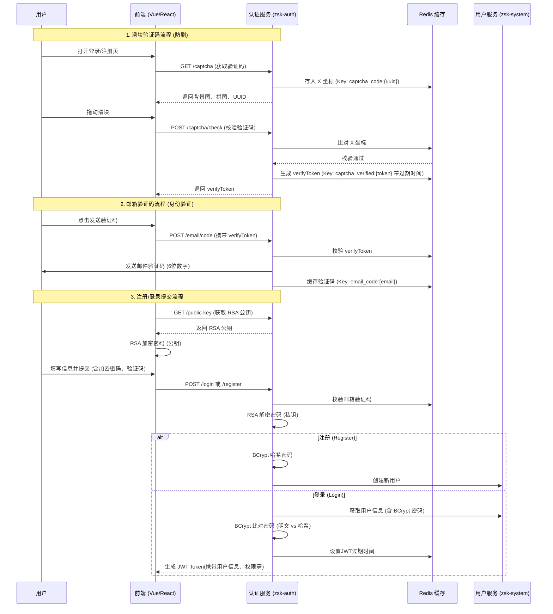
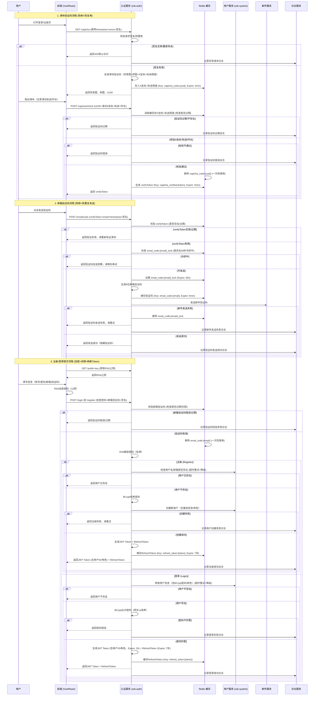

# 认证模块 (zsk-auth) 登录与注册流程说明

详细代码地址[zsk-cloud](https://github.com/MmzMing/zsk-cloud)
主要实现：滑块验证码（防刷） -> RSA 加密传输（防窃听） -> BCrypt 哈希存储（防拖库） -> 邮箱验证码（身份核验）
## 流程图（不包含异常处理）

## 流程图 (包含异常处理版)

## 技术栈 (Tech Stack)

本模块基于 Spring Cloud Alibaba 微服务架构，核心技术组件如下：

| 分类 | 组件 | 说明 |
| :--- | :--- | :--- |
| **核心框架** | Spring Boot, Spring Cloud Alibaba | 微服务基础架构 |
| **注册配置** | Nacos | 服务注册发现与分布式配置中心 |
| **熔断限流** | Sentinel | 接口限流（如验证码接口防刷）、熔断降级 |
| **安全框架** | Spring Security | 认证授权核心框架 |
| **令牌管理** | JWT (JSON Web Token) | 无状态身份验证令牌 |
| **持久化/缓存** | Redis | 缓存验证码 (TTL)、Token 黑名单、分布式锁 |
| **工具库** | Hutool, Lombok | 验证码生成、工具类简化、代码简化 |
| **邮件服务** | Apache Commons Email | 邮件发送服务（支持 HTML 模板） |
| **加密算法** | 胡图工具的RSA + BCrypt | 双重加密机制（传输层 RSA，存储层 BCrypt） |

```xml
    <dependencies>
   		 <!-- 本次不包含第三方认证
        <dependency>
            <groupId>org.springframework.boot</groupId>
            <artifactId>spring-boot-starter-oauth2-client</artifactId>
        </dependency>
         -->
        <!-- Spring Security 我这里主要是用到了security的加密服务，security我是全面放行，security用于管认证，而gateway管登录 -->
        <dependency>
            <groupId>org.springframework.boot</groupId>
            <artifactId>spring-boot-starter-security</artifactId>
        </dependency>
        <!-- Spring Cloud LoadBalancer 搭配security存储用户信息到线程上 -->
        <dependency>
            <groupId>org.springframework.cloud</groupId>
            <artifactId>spring-cloud-starter-loadbalancer</artifactId>
        </dependency>
        
        <!-- Sentinel Core -->
        <dependency>
            <groupId>com.alibaba.cloud</groupId>
            <artifactId>spring-cloud-starter-alibaba-sentinel</artifactId>
        </dependency>
        
        <!-- swagger -->
        <!-- ZSK API System -->
        <!-- 远程调用 System微服务，获取用户信息-->


        <!-- Nacos Discovery -->
        <dependency>
            <groupId>com.alibaba.cloud</groupId>
            <artifactId>spring-cloud-starter-alibaba-nacos-discovery</artifactId>
        </dependency>

        <!-- Nacos Config -->
        <dependency>
            <groupId>com.alibaba.cloud</groupId>
            <artifactId>spring-cloud-starter-alibaba-nacos-config</artifactId>
        </dependency>
        <!-- Hutool 内包含 BCrypt -->
        <dependency>
            <groupId>cn.hutool</groupId>
            <artifactId>hutool-all</artifactId>
        </dependency>
        <!-- Hutool 生成滑块验证码图片参数-->
        <dependency>
            <groupId>cn.hutool</groupId>
            <artifactId>hutool-captcha</artifactId>
        </dependency>

        <!-- Apache Commons Email -->
        <dependency>
            <groupId>org.apache.commons</groupId>
            <artifactId>commons-email</artifactId>
        </dependency>
    </dependencies>
```
## 1. 核心类说明

| 类名 | 路径 | 说明 |
| :--- | :--- | :--- |
| `AuthController` | `./auth.controller.AuthController` | 认证接口入口，处理 HTTP 请求 |
| `AuthServiceImpl` | `./auth.service.impl.AuthServiceImpl` | 认证业务逻辑实现的核心类 |
| `CaptchaServiceImpl` | `./auth.service.impl.CaptchaServiceImpl` | 滑块验证码生成与校验服务 |
| `EmailServiceImpl` | `./auth.service.impl.EmailServiceImpl` | 邮件发送与验证码校验服务 |
| `EncryptServiceImpl` | `./auth.service.impl.EncryptServiceImpl` | RSA 加解密服务 |
| `SecurityUtils` | `./common.security.utils.SecurityUtils` | 密码哈希与比对工具类 |
| `LoginRequest` | `./auth.domain.LoginRequest` | 登录请求参数封装 |
| `RegisterBody` | `./auth.domain.RegisterBody` | 注册请求参数封装 |

---

## 2. 滑块验证码流程 (Slider Captcha)

### 2.1 流程概述
滑块验证码用于人机识别，防止恶意刷接口。
1.  **生成验证码 (`GET /captcha`)**:
    *   生成随机背景图和拼图块。
    *   随机计算缺口位置 (x, y)。
    *   将 x 坐标存入 Redis (Key: `captcha_code:{uuid}`)，有效期 1 分钟。
    *   返回 Base64 格式的图片数据和 uuid。
2.  **校验验证码 (`POST /captcha/check`)**:
    *   接收前端上传的 uuid 和滑块移动距离 (code)。
    *   从 Redis 取出 x 坐标比对（允许 ±5 像素误差）。
    *   验证通过后，生成 `verifyToken` 存入 Redis (Key: `captcha_verified:{token}`)，有效期 5 分钟。
    *   返回 `verifyToken`，后续发送短信/邮件验证码时需携带此 Token。

### 2.2 核心代码

**响应对象：CaptchaResponse.java**
```java
/**
 * 验证码响应对象
 */
@Data
@Builder
@NoArgsConstructor
@AllArgsConstructor
public class CaptchaResponse {
    /** 验证码唯一标识 */
    private String uuid;
    /** 背景图片（Base64） */
    private String bgUrl;
    /** 拼图图片（Base64） */
    private String puzzleUrl;
    /** 滑块Y轴坐标 */
    private Integer y;
}
```

**生成验证码：CaptchaServiceImpl.java**
```java
@Override
public CaptchaResponse generateSlideCaptcha() {
    // ... 生成图片逻辑 ...
    
    // 6. 缓存X坐标用于校验
    String uuid = UUID.randomUUID().toString().replace("-", "");
    String captchaKey = CacheConstants.CACHE_CAPTCHA_CODE + uuid;
    redisService.setCacheObject(captchaKey, String.valueOf(x), 1, TimeUnit.MINUTES);

    return CaptchaResponse.builder()
            .uuid(uuid)
            .bgUrl(bgBase64)
            .puzzleUrl(puzzleBase64)
            .y(y)
            .build();
}
```

**校验验证码：CaptchaServiceImpl.java**
```java
@Override
public String validateCaptcha(String uuid, String code) {
    String captchaKey = CacheConstants.CACHE_CAPTCHA_CODE + uuid;
    String cachedX = redisService.getCacheObject(captchaKey);

    // ... 校验逻辑 ...
    int x = Integer.parseInt(code);
    int targetX = Integer.parseInt(cachedX);
    // 允许误差范围 ±5 像素
    if (Math.abs(x - targetX) > 5) {
        throw new AuthException("验证码错误");
    }

    // 生成验证通过凭证
    String verifyToken = UUID.randomUUID().toString().replace("-", "");
    String verifyKey = CacheConstants.CACHE_CAPTCHA_VERIFIED + verifyToken;
    redisService.setCacheObject(verifyKey, "true", 5, TimeUnit.MINUTES);
    
    return verifyToken;
}
```

---

## 3. 邮箱验证码流程 (Email Verification)

### 3.1 流程概述
用于注册、登录或找回密码时的身份验证。
1.  **发送验证码 (`POST /email/code`)**:
    *   **前置校验**：必须携带 `captchaVerification` (滑块验证通过凭证)。
    *   **凭证检查**：验证 `captchaVerification` 是否有效（防止跳过人机验证直接刷短信接口）。
    *   **生成发送**：生成 6 位随机数字，存入 Redis (Key: `email_code:{email}`)，发送 HTML 邮件。
    2.  **业务校验 (内部调用)**:
    *   在注册或登录接口中，调用 `emailService.validateEmailCode` 校验用户输入的验证码是否匹配且未过期。

### 3.2 核心代码

**发送入口：AuthController.java**
```java
@PostMapping("/email/code")
// 限制每个邮箱每1分钟最多发送5次验证码，需要配置sentinel
    @RateLimit(resource = "auth:email:code",key = "#email", count = 5, timeUnit = TimeUnit.MINUTES)
public R<Void> sendEmailCode(@RequestParam String email, @RequestParam String captchaVerification) {
    // 验证滑块验证码凭证 (关键安全步骤)
    captchaService.verifyCaptchaToken(captchaVerification);
    emailService.sendEmailCode(email);
    return R.ok();
}
```

**发送逻辑：EmailServiceImpl.java**
```java
@Override
public void sendEmailCode(String email) {
    String code = generateEmailCode(); // 生成6位数字
    String emailKey = CacheConstants.CACHE_EMAIL_CODE + email;

    // 缓存验证码，设置过期时间
    redisService.setCacheObject(emailKey, code, emailCodeExpire, TimeUnit.SECONDS);

    // 发送 HTML 邮件
    HtmlEmail htmlEmail = new HtmlEmail();
    // ... 配置邮件参数 ...
    htmlEmail.setHtmlMsg(getHtmlTemplate(code));
    htmlEmail.send();
}
```

**校验逻辑：EmailServiceImpl.java**
```java
@Override
public void validateEmailCode(String email, String code) {
    if (StringUtils.isEmpty(email) || StringUtils.isEmpty(code)) {
        throw new AuthException("邮箱和验证码不能为空");
    }

    String emailKey = CacheConstants.CACHE_EMAIL_CODE + email;
    String cachedCode = redisService.getCacheObject(emailKey);

    if (StringUtils.isEmpty(cachedCode)) {
        throw new AuthException("验证码已过期");
    }

    if (!code.equals(cachedCode)) {
        throw new AuthException("验证码错误");
    }

    // 验证通过后删除缓存，防止重复使用
    redisService.deleteObject(emailKey);
}
```

---

## 4. 注册流程 (Register)

### 4.1 流程概述
1.  **接收请求**：`AuthController` 接收 `POST /register` 请求。
2.  **参数校验**：Spring Validation 校验基础参数格式（非空、长度、邮箱格式等）。
3.  **业务处理** (`AuthServiceImpl.register`)：
    *   **密码解密**：使用 `EncryptService` 解密前端传输的 RSA 加密密码。
    *   **验证码校验**：调用 `EmailService` 验证邮箱验证码是否正确。
    *   **密码规则校验**：检查密码长度、确认密码是否一致。
    *   **唯一性检查**：调用远程用户服务 (`RemoteUserService`) 检查用户名是否已存在。
    *   **密码哈希**：使用 `SecurityUtils.encryptPassword` (BCrypt) 对密码进行哈希处理。
    *   **创建用户**：构建 `SysUserApi` 对象，调用远程服务创建新用户。

### 4.2 核心代码

**请求对象：RegisterBody.java**
```java
/**
 * 用户注册请求对象
 */
@Data
public class RegisterBody implements Serializable {
    /** 用户名 */
    @NotBlank(message = "用户名不能为空")
    @Length(min = 2, max = 20, message = "用户名长度必须在2到20个字符之间")
    private String username;

    /** 邮箱 */
    @NotBlank(message = "邮箱不能为空")
    @Email(message = "邮箱格式不正确")
    private String email;

    /** 用户密码 */
    @NotBlank(message = "密码不能为空")
    private String password;

    /** 确认密码 */
    @NotBlank(message = "确认密码不能为空")
    private String confirmPassword;

    /** 验证码内容 */
    @NotBlank(message = "验证码不能为空")
    private String code;

    /** 验证码标识 */
    @NotBlank(message = "验证码标识不能为空")
    private String uuid;
}
```

**入口：AuthController.java**
```java
	@Operation(summary = "用户注册")
	@PostMapping("/register")
	// 限制每个邮箱每1分钟最多注册10次，需要配置sentinel
	@RateLimit(resource = "auth:register", key = "#registerBody.email", count = 10, timeUnit = TimeUnit.MINUTES)
	public R<Void> register(@RequestBody @Valid RegisterBody registerBody) {
	    authService.register(registerBody);
	    return R.ok();
	}
```

**业务逻辑：AuthServiceImpl.java**
```java
@Override
public void register(RegisterBody registerBody) {
    String username = registerBody.getUsername();
    // 1. RSA 密码解密
    String password = encryptService.decrypt(registerBody.getPassword());
    String confirmPassword = encryptService.decrypt(registerBody.getConfirmPassword());
    String code = registerBody.getCode();
    String email = registerBody.getEmail();

    // 2. 验证邮箱验证码
    emailService.validateEmailCode(email, code);

    // ... 密码规则校验 ...

    // 3. 检查用户是否已存在
    R<LoginUser> result = remoteUserService.getUserInfo(username, CommonConstants.REQUEST_SOURCE_INNER);
    if (result != null && result.isSuccess() && result.getData() != null) {
        throw new BusinessException("保存用户'" + username + "'失败，注册账号已存在");
    }

    // 4. 构建用户对象并创建
    SysUserApi sysUser = new SysUserApi();
    sysUser.setUserName(username);
    // ... 设置属性 ...
    // 5. BCrypt 密码哈希加密
    sysUser.setPassword(SecurityUtils.encryptPassword(password)); 

    R<Boolean> registerResult = remoteUserService.createUser(sysUser);
    // ... 结果处理 ...
}
```

---

## 5. 登录流程 (Login)

### 5.1 流程概述
1.  **接收请求**：`AuthController` 接收 `POST /login` 请求，并通过 `@RateLimit` 进行限流。
2.  **分发逻辑**：`AuthServiceImpl` 根据 `loginType` (password/email/third-party) 分发到不同的处理方法。
3.  **密码登录 (`passwordLogin`)**：
    *   **获取用户信息**：调用 `RemoteUserService` 根据用户名获取用户信息。
    *   **验证码校验**：校验邮箱验证码。
    *   **密码解密**：使用 `EncryptService` 解密前端传输的 RSA 加密密码。
    *   **密码比对**：使用 `SecurityUtils.matchesPassword` (BCrypt) 比对解密后的密码与数据库中的哈希密码。
    *   **状态检查**：检查账号是否被停用。
    *   **生成令牌**：生成 JWT Token 返回。

### 5.2 核心代码
**请求对象：RegisterBody.java**
```java
@Data
public class LoginRequest {
    /**
     * 用户名
     */
    @Length(min = 2, max = 20, message = "用户名长度必须在2到20个字符之间")
    private String username;

    /**
     * 密码
     */
    @NotBlank(message = "密码不能为空")
    private String password;

    /**
     * 邮箱验证码
     */
    @NotBlank(message = "验证码不能为空")
    private String code;

    /**
     * 登录类型（password-密码登录，email-邮箱登录，qq-QQ登录，wechat-微信登录，github-GitHub登录）
     */
    @NotBlank(message = "登录类型不能为空")
    private String loginType;

    /**
     * 邮箱地址（邮箱登录时必填）
     */
    @Email(message = "邮箱格式不正确")
    private String email;

    /**
     * 邮箱验证码（邮箱登录时必填）
     */
    @NotBlank(message = "邮箱验证码不能为空")
    private String emailCode;

    // 第三方授权码（省略掉）
}

```
**发送入口：login.java**
```java
    /**
     * 用户登录
     *
     * @param request 登录参数
     * @return 登录结果
     */
    @Operation(summary = "用户登录")
    @PostMapping("/login")
		// 限制每个用户每1分钟最多注册10次，需要配置sentinel
    @RateLimit(resource = "auth:login", key = "#request.username", count = 10, timeUnit = TimeUnit.MINUTES)
    public R<LoginResponse> login(@Valid @RequestBody LoginRequest request) {
        LoginResponse response = authService.login(request);
        return R.ok(response);
    }
```

**业务分发：AuthServiceImpl.java**
```java
@Override
public LoginResponse login(LoginRequest request) {
    String loginType = request.getLoginType();
    return switch (loginType) {
        case "password" -> passwordLogin(request);
        case "email" -> emailLogin(request);
        // ...
        default -> throw new AuthException("不支持的登录类型: " + loginType);
    };
}
```

**密码登录逻辑：passwordLogin**
```java
private LoginResponse passwordLogin(LoginRequest request) {
    // ... 参数获取 ...

    // 1. 远程调用获取用户信息
    R<LoginUser> userResult = remoteUserService.getUserInfo(username, CommonConstants.REQUEST_SOURCE_INNER);
    if (userResult == null || !userResult.isSuccess()) {
        throw new AuthException("用户不存在");
    }
    LoginUser loginUser = userResult.getData();
    
    // ... 邮箱验证码校验 ...

    // 2. RSA 密码解密
    String decryptedPassword = encryptService.decrypt(password);
    
    // 3. BCrypt 密码比对
    SysUserApi user = loginUser.getSysUser();
    if (!SecurityUtils.matchesPassword(decryptedPassword, user.getPassword())) {
        throw new AuthException("用户名或密码错误");
    }

    // ... 状态检查与 Token 生成 ...
    return generateToken(loginUser);
}
```

---

## 6. 安全加密机制 (Security & Encryption)

本系统采用 **RSA + BCrypt** 双重加密机制，确保用户密码在传输和存储过程中的安全性。

### 6.1 传输层加密 (RSA)
前端在发送密码前，先获取服务端下发的 RSA 公钥进行加密，后端使用私钥解密。这防止了密码在网络传输中被明文截获。

*   **前端**：调用 `/public-key` 获取公钥 -> 使用 `JSEncrypt` 等库加密密码。
*   **后端**：`EncryptServiceImpl.decrypt` 使用私钥解密。

**后端 RSA 解密核心代码：**
```java
// EncryptServiceImpl.java
@Override
public String decrypt(String encryptedData) {
    try {
        PrivateKey privateKey = getPrivateKey();
        // 指定 RSA-OAEP 算法，匹配前端的 SHA-256 哈希
        Cipher cipher = Cipher.getInstance("RSA/ECB/OAEPWithSHA-256AndMGF1Padding");
        
        // 配置 OAEP 参数
        OAEPParameterSpec oaepParams = new OAEPParameterSpec(
                "SHA-256", "MGF1", MGF1ParameterSpec.SHA256, PSource.PSpecified.DEFAULT
        );

        cipher.init(Cipher.DECRYPT_MODE, privateKey, oaepParams);
        byte[] decryptedBytes = cipher.doFinal(Base64.getDecoder().decode(encryptedData));
        return new String(decryptedBytes);
    } catch (Exception e) {
        throw new BusinessException("数据解密失败");
    }
}
```

### 6.2 存储层加密 (BCrypt)
解密后的原始密码**绝不**直接存储到数据库。系统使用 **BCrypt** 算法对密码进行哈希处理。BCrypt 自动加盐，即使相同的密码每次生成的哈希值也不同。

*   **注册/重置密码**：使用 `SecurityUtils.encryptPassword` 生成哈希值存入数据库。
*   **登录验证**：使用 `SecurityUtils.matchesPassword` 验证明文密码是否与哈希值匹配。

**后端 BCrypt 工具类代码：**
```java
// SecurityUtils.java
public class SecurityUtils {
    /**
     * 生成 BCrypt 密码哈希
     * @param password 明文密码
     * @return 加密字符串 (含盐)
     */
    public static String encryptPassword(String password) {
        return BCrypt.hashpw(password);
    }

    /**
     * 验证密码
     * @param rawPassword     明文密码
     * @param encodedPassword 数据库存储的哈希密码
     * @return 是否匹配
     */
    public static boolean matchesPassword(String rawPassword, String encodedPassword) {
        return BCrypt.checkpw(rawPassword, encodedPassword);
    }
}
```
## 7. 限流机制 (Rate Limiting)

本系统实现了多维度的流量控制机制，结合 **Sentinel** 和 **Redis** 满足不同场景的需求。

### 7.1 策略概述
1.  **接口全局限流 (Sentinel)**: 适用于对某个接口的总并发量或 QPS 进行限制，保护系统不过载。
2.  **业务维度限流 (Redis)**: 适用于针对特定用户、IP 或业务 ID 的频率限制（例如：限制某用户每分钟只能尝试登录 10 次）。

### 7.2 部分核心代码

**限流注解：RateLimit.java**
```java
@Target(ElementType.METHOD)
@Retention(RetentionPolicy.RUNTIME)
public @interface RateLimit {
    /** 资源名称 (Sentinel用) */
    String resource() default "";

    /** 业务Key (Redis用，支持SpEL表达式，如 "#user.id") */
    String key() default "";

    /** 限流提示信息 */
    String message() default "请求过于频繁，请稍后再试";

    /** 限流阈值 */
    double count() default 5;

    /** 限流时间单位 */
    TimeUnit timeUnit() default TimeUnit.SECONDS;
}
```

**切面逻辑：SentinelAspect.java**
```java
@Around("@annotation(rateLimit)")
public Object aroundRateLimit(ProceedingJoinPoint point, RateLimit rateLimit) throws Throwable {
    String key = rateLimit.key();
    // 策略选择：配置了业务Key且Redis可用 -> Redis限流；否则 -> Sentinel限流
    if (StringUtils.isNotBlank(key) && redisService != null) {
        return handleRedisRateLimit(point, rateLimit);
    }
    return handleSentinelRateLimit(point, rateLimit);
}

// Redis 分布式限流实现
private Object handleRedisRateLimit(ProceedingJoinPoint point, RateLimit rateLimit) throws Throwable {
    String resourceName = getResourceName(point, rateLimit.resource());
    // 解析 SpEL 表达式获取业务值 (如用户名)
    String businessKey = parseSpel(rateLimit.key(), point);
    
    // 生成 Redis Key: rate_limit:auth:login:zhangsan
    String redisKey = "rate_limit:" + resourceName + ":" + businessKey;
    
    // 原子递增并校验
    Long count = redisService.increment(redisKey, 1);
    if (count != null && count == 1) {
        // 首次访问设置过期时间
        redisService.expire(redisKey, rateLimit.timeUnit().toSeconds(1), TimeUnit.SECONDS);
    }
    
    if (count != null && count > rateLimit.count()) {
         throw new RateLimitException(rateLimit.message());
    }
    return point.proceed();
}
```

**使用示例：AuthController.java**
```java
/**
 * 用户登录
 * 限制每个用户名每 10 分钟只能尝试登录 10 次
 */
@PostMapping("/login")
@RateLimit(resource = "auth:login", count = 10, timeUnit = TimeUnit.MINUTES, key = "#request.username")
public R<LoginResponse> login(@Valid @RequestBody LoginRequest request) {
    // ...
}
```